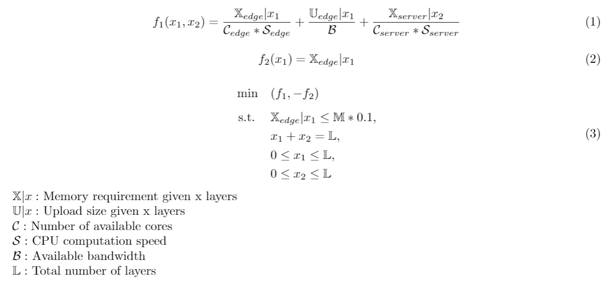

# Optimzation Problem for CNN Splitting on Edge Devices

This project tries to find the optimal splitting point of a CNN algorithm which would minimize the computation time and maximize the resource usage on the edge device under certain constraints.

The following equations define the optimization problem and the constraints.



## Installation

You would need Python 3 for running.

```
git clone https://github.com/rv355/cnn_splitting_optimization.git
cd cnn_splitting_optimization
python3 -m venv venv
source venv/bin/activate
python3 -m pip install pip --upgrade
python3 -m pip install wheel
python3 -m pip install -r requirements.txt
```

Modify the settings in the `settings.json` file as per your setup and run `cnn_split_optimize.py` to get the optimal results.

## Output
```
Latency_optimal Memory_optimal Edge_layers Server_Layers
1.5415500000000002e-05 -0.016236 11 21
```